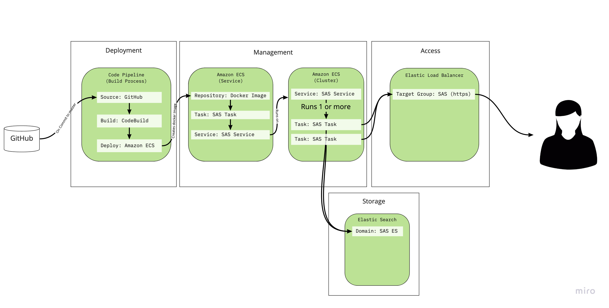

# Deployment of SimpleAnnotationServer (SAS) on Amazon Web Services (AWS)

The aim of this guide is to give information on how to host the SimpleAnnotationServer (SAS) in the Cloud using Amazon Web Services (AWS). The setup allows the management of SAS in GitHub and the automatic deployment to AWS when changes are made to the `master` branch. This is achieved through the use of Docker and hosting the Docker instance in Amazon's Elastic Container Service (ECS). The SAS Cloud service is made up of the following four components: 

**Deployment**
This does the following:
 * Monitor GitHub for changes to the master branch
 * Build a Docker Image
 * Store the image using the AWS Image Repository (part of ECS)

**Management**
This component is responsible for taking a Docker image and making it available as an ECS service. A ECS service can scale instances to cope with load and also monitors errors and replaces instances which are no longer healthy. In the diagram below this part is split into two:

 * Amazon ECS - Service
   * Responsible for managing Docker Images (ECS Repository)
   * Responsible for creating ECS Tasks that have running containers built from Docker Images
   * A Service that manages scaling and health monitoring of ECS Tasks
 * Amazon ECS - Cluster
   * A Cluster is responsible for running a service 
   * A cluster has assigned machines either a EC2 machine or Fargate.

**Storage**
It is possible to setup SAS with a number of backends that could be hosted using AWS but in this guide the storage will be an ElasticSearch instance as this is one of the available managed services through AWS. A managed service means Amazon will take care of backup and upgrades to the service. 

**Access**
The access component uses an Elastic Load Balancer to coordinate the incoming requests to an available ECS Service. The ECS service looks after the process of adding tasks to a Target Group. The Elastic Load Balancer manages the incoming requests and sends them to one of the ECS tasks that is in the Target group. 

A diagram of these components can be seen below:



## Rough Costs


## Setup

To ensure the components work together it is important to do the following steps in order. The AWS interfaces change regularly so rather than doing specific screen shots and specific instructions this guide gives information on the important fields and what they are used for. The setup detailed here is the cheapest setup that will work but notes will be given where it is possible to scale up the infrastructure if this is required. 

### Storage - Elastic Search Service

Before creating a Elastic Search domain we must create a user. To do this go to the Identity and Access Management (IAM) part of the AWS console. Add a User with **Programmatic access** and attach the `AmazonESReadOnlyAccess` policy. The Policy contains the following JSON:

```
{
    "Version": "2012-10-17",
    "Statement": [
        {
            "Action": [
                "es:Describe*",
                "es:List*",
                "es:Get*"
            ],
            "Effect": "Allow",
            "Resource": "*"
        }
    ]
}
```

When creating the user make note of the **Access Key** and **Secret Access Key** as this will be required when configuring the SAS container. Also make note of the user's ARN which can be copied from the User Summary screen after the user has been created. In later parts of this guide this user will be referred to as the ELASTIC_USER.

Next we need to create the ElasticSearch service by going to the AWS `Elasticsearch Service` in the list of AWS services. To use SAS we need to create a new Domain (which is equivalent to an Elastic Search Cluster). The configuration options are:

**Deployment type**
 * For this guide the recommended option is 'Development and testing' as this will create a single node in one availability zone. For larger instances you may want to use a production type. 

**Elasticsearch version**
 * Select the latest version of ElasticSearch. At the time of writing the latest version is `7.7`.

**Elasticsearch domain name**
 * This is the name of your ElasticSearch service. I used `elastic-sas` but it should be a name that would distinguish the SAS use of ElasticSearch as apposed to other services that might need an ElasticSearch cluster. 

**Data nodes**
 * This is where you could scale your ElasticSearch interface and have multiple nodes. AWS recommends a minimum of 3 nodes.
 * For this guide we will go for the cheapest option which is: 
   * Instance type: **t2.small.elasticsearch**
   * Number of nodes: 1

**Data nodes storage**
This is the data storage for your ElasticSearch instance. Annotations with SAS are generally very small so the defaults should be fine here:
 * **Data nodes storage type**: EBS
 * **EBS volume type**: General Purpose (SSD)
 * **EBS storage size per node**: 10 - this is 10GB of storage

**Dedicated master nodes**
As we only have 1 node in our cluster (see **Data nodes** above) it is not possible to set a dedicated master node so do not enable this. 

**Network configuration**
To allow you to view the ElasticSearch index it is advisable to give it Public Access but restrict who can access the instance. To do this select **Public Access** rather than VPC in Network configuration.

**Fine-grained access control**
As we are using a small instance, Fine grained access control isn't available. 

**Amazon Cognito authentication**
For this guide we will be creating an IAM role rather than using Cognito. Do not enable Amazon Cognito authentication if you are following this guide. 

**Access Policy**
To allow SAS access to the ElasticSearch cluster we need to add a custom access policy. We will have to edit this after the ElasticSearch instance has been created but for now enter set the first drop down to `IAM ARN`. In the text box enter (Enter Principal) put the User ARN you created earlier in the IAM screen. The third drop down should be `Allow`.

**Encryption**

Check **Require HTTPS for all traffic to the domain**. Do not select **Node-to-node encryption** or **Enable encryption of data at rest**. There is no need to fill in any of the **Optional Elasticsearch cluster settings**.

Now click `Confirm` to create your ElasticSearch instance. 

To aid development you may want to access ElasticSearch and Kabana from your development machine. If this is the case then select your domain and in the `Actions` drop down select **Modify access policy)**. Ensure JSON defined access policy is set and paste the following JSON:

```
{
  "Version": "2012-10-17",
  "Statement": [
    {
      "Effect": "Allow",
      "Principal": {
        "AWS": "USER_ARN"
      },
      "Action": "es:*",
      "Resource": "ELASTIC_SEARCH_ARN"
    },
    {
      "Effect": "Allow",
      "Principal": {
        "AWS": "*"
      },
      "Action": "es:ESHttp*",
      "Resource": "ELASTIC_SEARCH_ARN",
      "Condition": {
        "IpAddress": {
          "aws:SourceIp": "DEV_SERVER_IP"
        }
      }
    }
  ]
}
```

Making the following changes:
 * **USER_ARN**: You should find this on the summary screen of the IAM user you created at the start of the Storage part of this guide.
 * **ELASTIC_SEARCH_ARN**: You should find this on the ElasticSearch information screen for your domain. It will be named **Domain ARN**.
 * **DEV_SERVER_IP**: To allow you to view data in ElasticSearch add your IP address so that you can view ElasticSearch and Kabana without using the IAM login. 

You should now have an ElasticSearch instance that is ready to be used with SAS. 


### Access - Elastic Load Balancer

To be able to use ECS and Fargate we need to create an Elastic Load Balancer that will route incoming traffic to the correct ECS Task. To do this navigate to the EC2 service and scroll down to Load Balancers. Click Create load Balancer. 

**Load balancer type**: Application Load Balancer

**Name**: https-LoadBalancer

**Scheme**: Internet facing

**IP address type**: ipv4

**Listeners**: If you want to access your application using http then leave the default listener in place. You should also add a https listener by clicking Add listener and selecting https. 

**Availability Zones**: use the default for VPC and select two zones. 

**Configure Security Settings**: If you have a certificate then assign this to your Load balancer. As load balancers are quite expensive it makes sense to re-use them for different services. If you plan to do this then it is a good idea to create a wildcard certificate and assign it here. 

**Security policy**: BEN WHAT DO YOU SEE HERE?

**Configure Security groups**: BEN WHAT DO YOU SEE HERE?

**Configure routing**: This is where you setup the routing to the task and health check.

**Target group**: New target group

**Name**: SAS-target-group

**Type**: Instance

**Protocol**: HTTP

**PORT**: 80

**Health checks**: Protocol: http, path: `/index.html`

Due to another chicken and egg situation you won't be able to register targets as you haven't yet created the ECS service so skip to the Review step and click create Load Balancer. You need to do this step before the ECS steps as the service requires the Load Balancer to be available. 

### Management - Amazon Elastic Container Service

The Elastic Container Service (ECS) is the part of the Amazon Web Services that deal with the hosting and running of Docker images. The advantage of using this service is that you can use Docker locally when developing an application and then deploy it to AWS and know that all of the tools and environment will be consistently the same. 

The Docker process has two parts. The first is building an Image and the second process is running this image. In AWS the building part is done with code pipeline and ECS is only concerned with running an image. Due to a chicken and egg issue, we need to create the ECS configuration before setting up the code pipeline. ECS has the following components:

### Repositories
These are collections of Docker images. There is a charge for storing built images here and you may be able to use other repositories like [Docker Hub](https://hub.docker.com/) but I have only used the AWS repositories. We will need to create a new Repository to store our SAS Docker image. To do this navigate to the Amazon Container Service and click on Repositories then `create repository`. 

Options are:

__Repository name__: the name of the image. I used `sas`

__Image scan settings__: I left this disabled

__Encryption setting__: I left this disabled 

Click `Create repository`. In the list of images make note of the URI for the image as this will be required in the CodePipeline build step. The CodePipeline build process will automatically add new image versions when a change is detected in GitHub. 

### Tasks 
Tasks are running Docker images. This is where you configure the Docker Image, allocate minimum system requirements (RAM /CPU) and attach persistent storage. 

Services are mentioned in more detail below but a Service is made up of 1 or more copies of a Task. A service then runs on a cluster. The service is responsible for making sure the correct number of tasks are run and that they are all healthy. A service can create new tasks or replace unhealthy tasks. 

We are going to create a SAS task and attach the Docker image as a container within this task. To do this navigate to Tasks Definitions and click `Create new Task Definition`. 

#### EC2 or Fargate?
After you create a task it will ask you if you want to use EC2 or Fargate. 

With EC2 you have to create an EC2 instance and add it to your cluster. You can setup your cluster to automatically add extra EC2 instances if the first instance is becoming overloaded but there is more configuration for this option. The advantages are that you can run multiple services on a single EC2 machine and if they don't use much resources this could be a cheaper option. The second big advantage is that you can ssh into a EC2 instance and diagnose any issues you come across. Although with ECS managed tasks if a task becomes unhealthy then it is replaced which can make trouble shooting difficult as you may connect to an instance but not be able to read the logs as it may have been replaced.  

Fargate creates a virtual machine which your task runs on. You can't ssh into this machine but it has the advantage of being isolated from other tasks so if your SAS task is under heavy load it won't affect the other services you are running. 

For this guide we will be using Fargate as it makes the process easier to manage. 

Once you have selected Fargate you can create the Task with the following options:

**Task name**: SAS-task (note it is useful to include the type of thing you are creating in the name so that you can see where different things are considered, the first time I did this I called everything SAS and couldn't see which things were tasks and which were services).

**Task Role**:  None

**Network Mode**: awsvpc (hard coded if using Fargate)

**Task execution IAM role**: allow ECS to create a role for you

**Task size**: Memory 0.5GB. CPU 0.25 - this is the resources to allocate to SAS. If you find SAS is too slow these can be increased. 

#### Container

The add Container screen is where you configure the SAS Docker image. Up until now most of the configuration has been general to ECS but the Container configuration is where you setup the specific SAS configuration. The options are:

**Container name**: SAS_container (see note above about including the name of components in names)

**Image**: Paste in the id of your repository and add `:latest` to the end for example:

`082101253860.dkr.ecr.eu-west-2.amazonaws.com/sas:latest`

**Memory Limits (MiB)**: this is where you configure the minimum amount of memory the SAS task needs to run. Set this too high and ECS won't deploy your task. You can set a hard or soft limit. If you set a hard limit your task will be killed if SAS goes over this limit. A soft limit makes sure this memory is available before it is deployed. A low value means the task will almost always be deployed. Set it to soft limit of 300MB which is the minimum recommend for a Web Application. 

**Port Mappings**: This is where you map your internal Docker ports to ports you can access. The only port that SAS listens to is 8888 so enter that here and set the protocol to TCP. 

Leave the rest of the config as defaults and scroll down to **Environment variables**. This is where you tell SAS which backend to use and pass in credentials to log in. You will need to set the following values:

 * `AWS_ACCESS_KEY_ID` the access key for the ELASTIC_USER created earlier
 * `AWS_SECRET_ACCESS_KEY` the secret key for the ELASTIC_USER created earlier
 * `AWS_REGION`: AWS region e.g. `eu-west-2`
 * `SAS_elastic_connection`: your Elastic Search domain URL plus an index. In this case the index is `annotations`  e.g:

`https://search-elastic-sas-nfskj6q5cw7664b3cszjo6gwmi.eu-west-2.es.amazonaws.com/annotations`

 * `SAS_store`: `elastic` 

Leave the rest of the container configuration to the defaults and click create.

You can also leave the rest of the task configuration as defaults and click create.

You should now have a SAS task which can be added to a service and run on a cluster. 

#### ECS Cluster

To run tasks they need to be added to a Service. Services then run on a cluster so we will create the cluster. Navigate to ECS and click on Clusters then create new cluster.

You will then be given the option of a template. Select the Networking only Fargate template. 

Give your cluster a name. 

For this guide don't create a VPC or enable CloudWatch insights. Click create cluster. Now you have a cluster we will create a service that will run the SAS tasks.

#### ECS Service
A service is responsible for creating and running tasks. If configured to do so it will add tasks to cope with load and then remove them when they are no longer needed. Service will also monitor the health of tasks and replace them if they are no longer healthy. 

The CodePipeline component will create a new version of SAS task and the service is responsible for removing the previous task version and running the new version. 

To create a service navigate to ECS and click on your cluster. You should see a Service tab with a create button. Select the following options:

**Launch type**: Fargate

**Task Definition**: SAS-Task

**Revision**: Choose latest

**Platform version**: Latest

**Cluster**: select your cluster

**Service name**: SAS-Service

**Number of tasks**: 1 - this is where you can set the ideal number of SAS tasks. If you run a very busy site you may think of increasing this. There are options later on to automatically add tasks if the load becomes too high. 

**Minimum healthy percent**: 100 - this means there will always be one running task

**Maximum percent**: 200

**Deployment type**: Rolling update

**Task Placement**: AZ Balanced Spread

**VPC and security groups**: BEN - could you screen shot this?

**Health check grace period**: 0

**Load balancing**: Application Load Balancer - Load balancing allows you to have multiple tasks and it will route incoming traffic to the correct task. 

**Service IAM role**: createNewRole

**Load balancer name**:  Select the load balancer you create earlier. 

**Container to load balance**: sas-container:0:8888

Don't enable **App Mesh** or **Service discovery**.

**Set Auto Scaling**: Optionally set auto scaling dependent on load. This will create new tasks if required. Note this can only be set on service creation. 

Now create the service. 

You have now create the infrastructure to Run SAS and you now need to create the process to deploy changes from GitHub to ECS.

### Deployment - CodePipeline 


