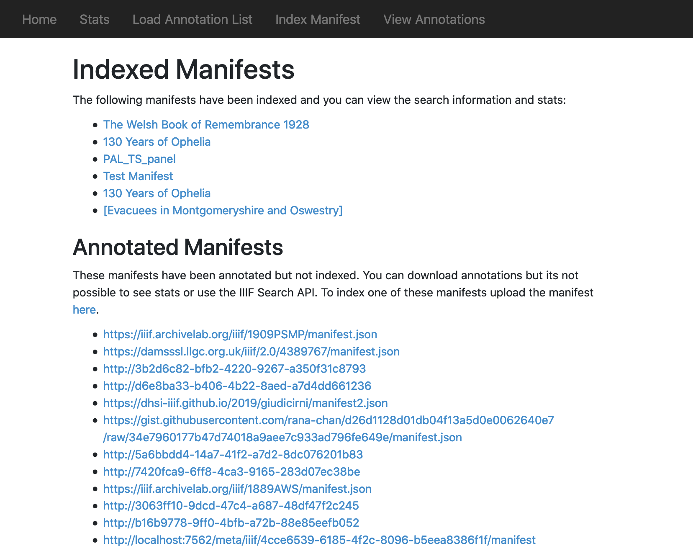
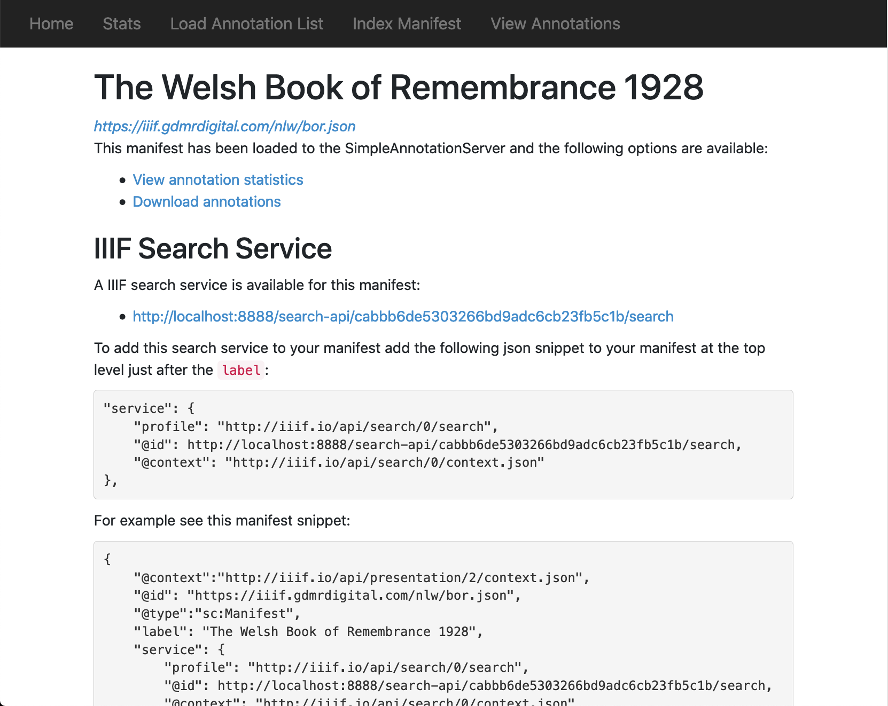
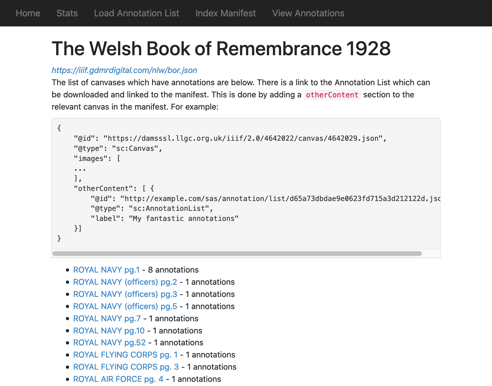

# Hosting the annotations locally and linking to a manifest

Sometimes it can be helpful to publish your annotations as static files to allow readonly access to the annotations. To do this you need to create an annotation list per canvas you have annotated. You can do this through the SAS web interface by navigating to the View Annotations link:

http://localhost:8888/manifests.xhtml

This will take you to a list of Manifests that have been annotated. Some are Indexed which means you followed the [upload Manifest]() instructions. Others have been annotated without indexing the manifest. For this second type you can only download the annotations. For indexed manifests you can use the [IIIF Search API]() and view Stats on progress. 



To download the annotation for an indexed manifest select the manifest and this will take you to a Manifest screen where you can download annotation, see stats and setup the IIIF Search API.



On this screen select 'Download annotations'. This will take you to the list of canvases for that Manifest. 



For manifests that haven't been indexed clicking the Manifest you are interested in will take you straight to the list of canvases. Once you have the list of canvases you can click on the link and this will take you to a `AnnotationList` which can be linked into your manifest. See the instructions on the List Canvas Screen.

## Batch downloading annotations

You can do this by running the included `scripts/downloadAnnotationListsByCanvas.py`. This is run as follows:

```
# downloadAnnotationListsByCanvas.py [manifest] [sas_endpoint] [output_dir] [optional outputfilename proc]
./scripts/downloadAnnotationListsByCanvas.py http://dams.llgc.org.uk/iiif/newspapers/3320639.json http://localhost:8888 /tmp/annotations
```

Where:
 * mainfest is the manifest you want the annotations for. Note this will download a file per canvas in this manifest.
 * sas_endpoint the SimpleAnnotationServer that contains the annotations.
 * output_dir the output directory for the annotation files.

If you followed the instructions on loading the [example newspaper manifest](NewManifests.md) and [populating the annotation list](PopulatingAnnotations.md), you will see the following:

```
SimpleAnnotationServer glen$ ./scripts/downloadAnnotationListsByCanvas.py http://dams.llgc.org.uk/iiif/newspaper/issue/3320640/manifest.json  http://localhost:8888 /tmp/annotations
Downloading manifest
Downloading http://dams.llgc.org.uk/iiif/3320640/canvas/3320641
Downloading http://dams.llgc.org.uk/iiif/3320640/canvas/3320642
Downloading http://dams.llgc.org.uk/iiif/3320640/canvas/3320643
Downloading http://dams.llgc.org.uk/iiif/3320640/canvas/3320644
SimpleAnnotationServer glen$ ls /tmp/annotations/
page1.json      page2.json      page3.json      page4.json
```

You will need to put these json files somewhere publicly accessible on a http server along with your manifest. For example if you were to host them on `http://example.com/files/page1.json` you could then reference them from your manifest by adding the following within the canvas section:

```
  "@id": "http://dams.llgc.org.uk/iiif/3320640/canvas/3320641",
  "@type": "sc:Canvas",
  ...
 "images": [
    ...
 ],
 "otherContent": [
    {
        "@id": "http://example.com/files/page1.json",
        "@type": "sc:AnnotationList",
        "label": "My fantastic annotations"
    }]
```
